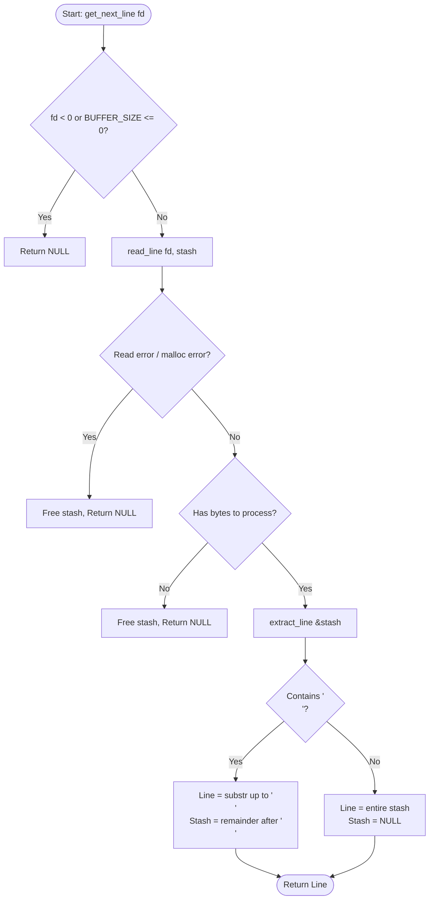

<div align="center">

# 📖 get_next_line

### *Reading a line from a file descriptor is way too tedious.*

<p align="center">
  
  
  
  
</p>

<p align="center">
  <a href="#-about-the-project">About</a> •
  <a href="#-how-it-works">How It Works</a> •
  <a href="#-flowchart">Flowchart</a> •
  <a href="#-bonus-part">Bonus Features</a> •
  <a href="#-file-structure">File Structure</a> •
  <a href="#-getting-started">Getting Started</a> •
  <a href="#-edge-cases--memory-management">Edge Cases</a> •
  <a href="#-testing">Testing</a>
</p>

---

</div>

## 📌 About The Project

`get_next_line` is a fundamental project in the **42 Network** curriculum. The objective is to code a C function that returns a single line read from a file descriptor (`fd`), ending with a newline character (`\n`) if one exists, or terminating at End-Of-File (`EOF`).

Calling `get_next_line` in a loop allows you to read the text available on a file descriptor one line at a time until the end of the text.

### Key Learning Objectives

* **Static Variables**: Mastering static storage duration in C to preserve state across repeated function calls.
* **Buffer Management**: Efficiently reading chunks of arbitrary `BUFFER_SIZE` bytes and stitching them together.
* **Dynamic Memory & Leak Prevention**: Allocating, expanding, and freeing memory cleanly without leaks or dangling pointers.
* **File Descriptors**: Interfacing with POSIX system calls (`read`, `open`, `close`) and handling edge cases (standard input, pipes, files).

---

## ⚙️ How It Works

`get_next_line` operates in a 3-step lifecycle:

```
                  ┌───────────────────────────────┐
                  │      get_next_line(fd)        │
                  └──────────────┬────────────────┘
                                 │
                   1. READ BUFFER CHUNKS
                                 ▼
                  ┌───────────────────────────────┐
                  │    read_line(fd, stash)       │
                  │  Reads BUFFER_SIZE until '\n' │
                  │     or EOF is reached         │
                  └──────────────┬────────────────┘
                                 │
                   2. EXTRACT VALID LINE
                                 ▼
                  ┌───────────────────────────────┐
                  │     extract_line(&stash)      │
                  │ Slices [start ... '\n']       │
                  └──────────────┬────────────────┘
                                 │
                   3. UPDATE STATIC STASH
                                 ▼
                  ┌───────────────────────────────┐
                  │ Saves leftover characters     │
                  │ into `stash` for next call    │
                  └──────────────┬────────────────┘
                                 │
                                 ▼
                         Return: char *line
```

### The Stash (Static Memory Buffer)

When reading from a file descriptor with a given `BUFFER_SIZE`, `read()` may pull characters that belong to subsequent lines. The static variable `stash` acts as an accumulator:

1. **Read & Accumulate**: Read `BUFFER_SIZE` bytes into a temporary buffer and append them to `stash` until `stash` contains a `\n` or `read()` returns 0.
2. **Line Extraction**: Locate `\n`. Everything from index `0` up to `\n` is duplicated and returned as the current line.
3. **Remainder Preservation**: Everything after `\n` is preserved in `stash` for the next call. The previous memory is freed.

---

## 📊 Flowchart



---

## 🌟 Bonus Part

The bonus implementation elevates `get_next_line` to support **concurrent multi-descriptor reading**:

| Feature | Mandatory Part | Bonus Part |
| :--- | :--- | :--- |
| **Static Variable** | `static char *str;` (Single FD) | `static char *str[1024];` (Array of FDs) |
| **Multi-FD Support** | ❌ Reads one FD at a time | ✅ Reads from multiple FDs without losing state |
| **Default BUFFER_SIZE** | `10` | `42` |
| **Filenames** | `get_next_line.c`<br>`get_next_line_utils.c`<br>`get_next_line.h` | `get_next_line_bonus.c`<br>`get_next_line_utils_bonus.c`<br>`get_next_line_bonus.h` |

### Multi-FD Example
You can alternate calls between `fd_1`, `fd_2`, and standard input (`0`) without losing the reading thread of each descriptor:

```c
line_a = get_next_line(fd_1); // Reads line 1 from file A
line_b = get_next_line(fd_2); // Reads line 1 from file B
line_c = get_next_line(fd_1); // Reads line 2 from file A
```

---

## 📂 File Structure

```text
get_next_line/
├── get_next_line.h              # Header file with prototypes & default BUFFER_SIZE
├── get_next_line.c              # Core algorithm (get_next_line, read_line, extract_line)
├── get_next_line_utils.c        # Helper functions (strlen, strchr, strjoin, strdup, substr)
├── get_next_line_bonus.h        # Bonus header with multi-FD support
├── get_next_line_bonus.c        # Bonus core algorithm with static array
└── get_next_line_utils_bonus.c  # Bonus helper functions
```

### Helper Functions Breakdown

* [`ft_strlen`](file:///Users/mac/Desktop/get_next_line/get_next_line_utils.c#L15): Calculates string length.
* [`ft_strchr`](file:///Users/mac/Desktop/get_next_line/get_next_line_utils.c#L27): Locates the first occurrence of `\n` or a specific character in a string.
* [`ft_strjoin`](file:///Users/mac/Desktop/get_next_line/get_next_line_utils.c#L45): Concatenates two strings into a newly allocated block while freeing the prefix buffer.
* [`ft_strdup`](file:///Users/mac/Desktop/get_next_line/get_next_line_utils.c#L73): Duplicates a string with dedicated dynamic memory allocation.
* [`ft_substr`](file:///Users/mac/Desktop/get_next_line/get_next_line_utils.c#L93): Extracts a substring from index `start` with length `len`.

---

## 🚀 Getting Started

### Function Prototype

```c
char *get_next_line(int fd);
```

| Parameter | Type | Description |
| :--- | :--- | :--- |
| `fd` | `int` | The file descriptor to read from |
| **Return Value** | `char *` | The line read (including `\n` if present), or `NULL` if EOF is reached or an error occurred |

### Usage Example

Create a `main.c` file:

```c
#include "get_next_line.h"
#include <stdio.h>
#include <fcntl.h>

int main(void)
{
    int     fd;
    char    *line;
    int     line_number;

    fd = open("example.txt", O_RDONLY);
    if (fd < 0)
    {
        perror("Error opening file");
        return (1);
    }
    line_number = 1;
    while ((line = get_next_line(fd)) != NULL)
    {
        printf("[%02d] %s", line_number++, line);
        free(line); // Remember to free allocated line!
    }
    close(fd);
    return (0);
}
```

### Compilation

Compile your project specifying any `BUFFER_SIZE` value:

```bash
# Standard compilation with custom BUFFER_SIZE
cc -Wall -Wextra -Werror -D BUFFER_SIZE=42 get_next_line.c get_next_line_utils.c main.c -o gnl

# Run the executable
./gnl

# Bonus compilation
cc -Wall -Wextra -Werror -D BUFFER_SIZE=42 get_next_line_bonus.c get_next_line_utils_bonus.c main_bonus.c -o gnl_bonus
```

---

## 🛡️ Edge Cases & Memory Management

`get_next_line` is built to gracefully handle all common edge cases:

| Scenario | Handled Behavior |
| :--- | :--- |
| **Invalid FD (`fd < 0`)** | Immediately returns `NULL` without any allocation. |
| **`BUFFER_SIZE <= 0`** | Guard clause returns `NULL`. |
| **File with No Newlines** | Reads until EOF and returns the full string; subsequent call returns `NULL`. |
| **File Ending with `\n`** | Returns line including `\n`; subsequent call returns `NULL`. |
| **Empty File (`0 bytes`)** | Returns `NULL` on the very first call. |
| **Variable Buffer Sizes** | Tested with `BUFFER_SIZE=1`, `BUFFER_SIZE=42`, `BUFFER_SIZE=10000000`. |
| **Standard Input (`fd = 0`)** | Reads line-by-line from terminal or pipe (`cat file \| ./gnl`). |
| **Read Error (-1)** | Frees internal temporary buffers and stash to ensure 0 memory leaks. |

### Memory Leak Verification

Run with **Valgrind** to verify clean memory disposal:

```bash
valgrind --leak-check=full --show-leak-kinds=all --track-origins=yes ./gnl
```

Expected output:
```text
All heap blocks were freed -- no leaks are possible
ERROR SUMMARY: 0 errors from 0 contexts
```

---

## 🧪 Testing

This project has been rigorously tested with popular 42 community test suites:

* [Tripouille/gnlTester](https://github.com/Tripouille/gnlTester)
* [xicoduc/francinette](https://github.com/xicoduc/francinette)
* [charlesPf/gnl-war-machine-v2019](https://github.com/charlesPf/gnl-war-machine-v2019)

---

## 👨‍💻 Author

* **Mohamed Ouardan** ([@mowardan](https://github.com/mowardan))
* 42 Student • 1337 Coding School

---

<div align="center">
  <sub>Made with ❤️ for 42 Network. If this project helped you, don't forget to star ⭐ this repository!</sub>
</div>
